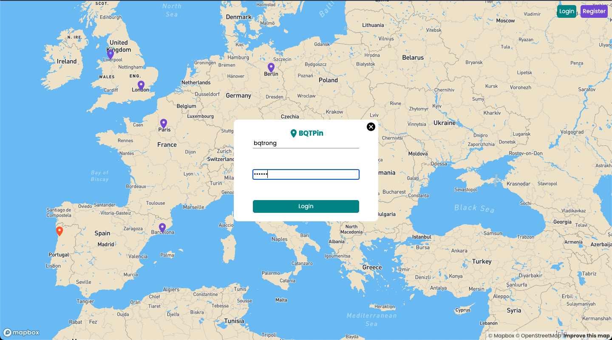

# Google Map-react

## About The Project

- Google Map in React project
- Authentication in Express.js
- MongoDB
- [Mapbox API](https://www.mapbox.com/)

## Features

(<a href="#top">back to top</a>)

